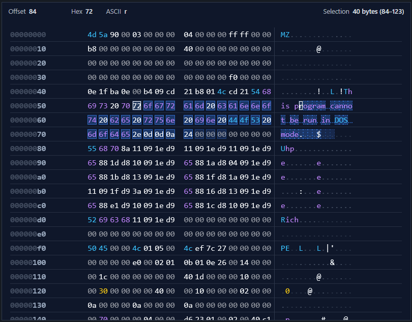

# VueHex

[](https://vvollers.github.io/vuehex/demo/)
[](https://vvollers.github.io/vuehex/docs/)

## Description

VueHex is a fast, virtualized hex viewer/editor component for Vue 3. It can be used both for cleanly viewing and editing binary data and for efficiently handling very large datasets.

* No dependencies
* Small package (~72KB minimized / ~18KB zipped)
* Render any local or remote data
* Can handle extremely large data sizes
* Very flexible and themeable, can be as simple or as complicated as you wish



## Installation

```bash
npm install vuehex
```

Register the plugin once to make the `<VueHex>` component available everywhere and load the bundled styles:

```ts
import { createApp } from "vue";
import VueHex from "vuehex";
import "vuehex/styles";

import App from "./App.vue";

const app = createApp(App);
app.use(VueHex);
app.mount("#app");
```

## Quick start

It can be as simple as this

```vue
<template>
  <VueHex
    v-model="windowData"
  />
</template>

<script setup lang="ts">
import { ref } from "vue";

const backingFile = crypto.getRandomValues(new Uint8Array(2 ** 20));
const windowData = ref(backingFile.slice(0, 16 * 48));
</script>
```

## Props

| Prop | Default | Description |
|------|---------|-------------|
| `dataMode` / `data-mode` | `auto` | Data handling mode: `auto`, `buffer`, or `window`. |
| `expandToContent` / `expand-to-content` | `false` | Disables internal scrolling/virtualization and expands the component height to fit the full buffer (expects the full data in `v-model`). |
| `totalSize` | `modelValue.length` | Total bytes available. |
| `bytesPerRow` | `16` | Number of bytes to display per row. |
| `uppercase` | `false` | Whether to display hex values in uppercase. |
| `nonPrintableChar` | `'.'` | Character to display for non-printable bytes in ASCII column. |
| `isPrintable` / `renderAscii` | — | Functions to customize ASCII rendering. |
| `theme` | — | Color theme: `'dark'`, `'light'`, `'terminal'`, `'sunset'`, or `'auto'`. Omit to follow `prefers-color-scheme` between dark and light. |
| `cellClassForByte` | — | Function `(payload: { kind: 'hex' \| 'ascii'; index: number; byte: number }) => string \| string[] \| void` for custom highlighting. |
| `getSelectionData` | — | Function `(selectionStart: number, selectionEnd: number) => Uint8Array` used for clipboard copy (required when using virtual windows; auto-implemented in full-data mode). |
| `overscan` | `2` | Number of extra rows to render above and below the viewport. |
| `showChunkNavigator` + `chunkNavigatorPlacement` | — | Enable and configure the optional chunk navigator UI. |
| `statusbar` | `null` | Status bar placement: `'top'`, `'bottom'`, or `null` to hide. Shows byte info on hover and selection details. |
| `statusbarLayout` | — | Configuration object controlling which items appear in the status bar and their placement (`left`, `middle`, `right` sections). |
| `cursor` | `false` | Enable keyboard/click cursor navigation. Navigate with arrow keys when focused or click bytes to move cursor. |
| `editable` | `false` | Enable editor mode. Typing/paste/cut emit `edit` intents. Cursor is automatically enabled while editing. |

## Models

VueHex uses Vue 3's `defineModel` for two-way data binding. These support `v-model` syntax:

| Model | Type | Default | Description |
|-------|------|---------|-------------|
| `v-model` (modelValue) | `Uint8Array` | `new Uint8Array(0)` | The currently visible data buffer. In buffer mode, this is the entire dataset; in window mode, this is the current slice. |
| `v-model:windowOffset` | `number` | `0` | Absolute byte offset of the current window. Automatically updates when scrolling, and scrolls the viewer when changed externally. Use for two-way sync of scroll position. |
| `v-model:cursorLocation` | `number \| null` | `null` | Current cursor position (absolute byte index). Only active when `cursor` prop is `true`. Automatically updates when navigating with keyboard/mouse. |

## Events

VueHex emits several events to enable interactive features:

| Event | Payload | Description |
|-------|---------|-------------|
| `updateVirtualData` | `{ offset: number, length: number }` | Emitted when the component needs more data in windowed mode. Load the requested byte range and update `v-model` with the new data. |
| `edit` | `VueHexEditIntent` | Emitted when `editable` is enabled and the user types, deletes, pastes, or cuts. In windowed mode, the parent should apply the intent to the backing store and refresh `v-model`. |
| `byte-click` | `{ index: number, byte: number, kind: 'hex' \| 'ascii' }` | Emitted when a user clicks on a specific byte cell. `index` is the absolute byte position, `byte` is the value (0-255), and `kind` indicates whether the hex or ASCII column was clicked. |
| `selection-change` | `{ start: number \| null, end: number \| null, length: number }` | Emitted when the selection range changes. `start` and `end` are absolute byte positions (inclusive), or `null` if nothing is selected. `length` is the number of selected bytes. |
| `row-hover-on` / `row-hover-off` | `{ offset: number }` | Emitted when hovering over/leaving a row. |
| `hex-hover-on` / `hex-hover-off` | `{ index: number, byte: number }` | Emitted when hovering over/leaving a hex cell. |
| `ascii-hover-on` / `ascii-hover-off` | `{ index: number, byte: number }` | Emitted when hovering over/leaving an ASCII cell. |

## Editable mode

Set `editable` to turn VueHex into a hex editor. VueHex emits a single `edit` event describing user intent.

Editing highlights:

- Click hex vs ASCII to choose the active column (or press `Tab` to toggle).
- Press `Insert` to toggle insert/overwrite mode.
- Hex typing commits after two nibbles.
- Selection integrates with editing: typing/paste replaces the selection; `Delete`/`Backspace` delete the selection.
- Clipboard shortcuts:
    - `Ctrl/Cmd+C` copy selection
    - `Ctrl/Cmd+V` paste (hex column treats clipboard as hex bytes; whitespace is ignored)
    - `Ctrl/Cmd+X` cut (copy + delete selection)
- Undo/redo shortcuts:
    - `Ctrl/Cmd+Z` undo
    - `Ctrl/Cmd+Y` redo (also `Ctrl/Cmd+Shift+Z`)

### Buffer mode (self-managed)

In `data-mode="buffer"`, VueHex will apply edits to `v-model` automatically. Listening to `@edit` is optional.

Undo/redo is built-in in this mode and is implemented as a compact history of edit diffs (not full buffer snapshots).

```vue
<template>
    <VueHex v-model="bytes" data-mode="buffer" editable style="height: 320px" />
</template>

<script setup lang="ts">
import { ref } from "vue";
import VueHex from "vuehex";

const bytes = ref(new Uint8Array(await file.arrayBuffer()));
</script>
```

### Window mode (parent-managed)

In `data-mode="window"`, VueHex does not own the full dataset. The parent is responsible for applying `edit` intents to the backing store and then refreshing `windowData`.

For undo/redo in windowed mode, VueHex emits `{ kind: "undo" }` / `{ kind: "redo" }` intents on the `edit` event and the parent should implement history.

```vue
<template>
    <VueHex
        v-model="windowData"
        data-mode="window"
        :window-offset="windowOffset"
        :total-size="store.length"
        :get-selection-data="getSelectionData"
        editable
        style="height: 320px"
        @updateVirtualData="handleUpdateVirtualData"
        @edit="handleEdit"
    />
</template>

<script setup lang="ts">
import { ref } from "vue";
import VueHex, { type VueHexEditIntent, type VueHexWindowRequest } from "vuehex";

const store = ref(new Uint8Array(await file.arrayBuffer()));
const windowOffset = ref(0);
const windowData = ref(new Uint8Array());
let windowLength = 0x4000;

function handleUpdateVirtualData(request: VueHexWindowRequest) {
    windowOffset.value = request.offset;
    windowLength = request.length ?? windowLength;
    windowData.value = store.value.slice(windowOffset.value, windowOffset.value + windowLength);
}

function getSelectionData(start: number, end: number) {
    const from = Math.min(start, end);
    const to = Math.max(start, end);
    return store.value.slice(from, to + 1);
}

function handleEdit(intent: VueHexEditIntent) {
    // Apply the intent to your backing store, then refresh windowData.
    // (See Storybook "Editable (windowed)" / docs guide for a complete apply function.)
    store.value = applyEditIntent(store.value, intent);
    windowData.value = store.value.slice(windowOffset.value, windowOffset.value + windowLength);
}
</script>
```

## Styling options

1. Import `vuehex/styles` for the default look.
2. Pass `theme="dark" | "light" | "terminal" | "sunset" | "auto"` to toggle bundled palettes explicitly (or skip the prop entirely to stick with OS detection).
3. Roll your own styles targeting the emitted class names (`.vuehex`, `.vuehex-byte`, `.vuehex-ascii-char`, etc.). The default sheet sets `.vuehex { height: 100%; }`, so remember to give the wrapper a concrete height.

## How VueHex handles large datasets

### Technique 1/3 : Virtual Scrolling

Instead of rendering **all** rows in the DOM, which works fine for small files but quickly becomes unusable for large datasets. A 1 MB file with 16 bytes per row produces over 65,000 DOM nodes. A 100 MB file? 6.5 million nodes. Browsers slow to a crawl when manipulating or even keeping these trees in memory.

VueHex solves this with optimized **virtual scrolling**:

1. **Calculate the full height** – VueHex computes how tall the entire table *would* be if every row were rendered (e.g., 65,000 rows × 24px = 1,560,000px).
2. **Create a container of that height** – The scroll container's inner wrapper is sized to the full calculated height, so the scrollbar represents the entire dataset.
3. **Render only visible rows** – As you scroll, VueHex calculates which rows are currently in the viewport (plus a small overscan buffer above/below) and renders **only** those rows.
4. **Translate the table** – The rendered slice is positioned at the correct scroll offset using CSS `transform: translateY()` so it appears in the right place as you scroll.

**Result:** Instead of 65,000 DOM nodes for a 1 MB file, VueHex renders ~50 rows (what fits on your screen + overscan). Scrolling through a 100 MB file feels instant because the browser only ever manages a tiny fraction of the data.

### Technique 2/3 : Chunking

The above technique works very well, but unfortunately it has a limit. Browsers impose limits on element dimensions to prevent rendering engine crashes. Most modern browsers cap `max-height` at around **33,554,432 pixels** (Chrome/Edge) or **17,895,698 pixels** (Firefox). Once your calculated scroll container height exceeds this limit, virtualization breaks—the scrollbar becomes inaccurate, and you can't reach data beyond the cap.

For a hex viewer/editor with 16 bytes per row and 24px row height:
- **Firefox limit:** ~746,000 rows = ~11.4 MB of data
- **Chrome limit:** ~1.4 million rows = ~21.4 MB of data

Files larger than these thresholds need **chunking**:

1. **Divide the dataset into chunks** – VueHex splits the file into manageable pieces (e.g., 20,000 rows per chunk).
2. **Render one chunk at a time** – The scroll container only represents the *current chunk*, keeping its height safely below browser limits.
3. **Provide chunk navigation** – Users click through chunks via the optional chunk navigator UI, and VueHex resets the scroll position and loads the next slice of data.

**Why this matters:**
- Without chunking, a 100 MB file would require a scroll container **416 million pixels tall**—far beyond any browser's rendering capabilities.
- With chunking (e.g., 10,000 rows per chunk = 240,000px per chunk), the same file becomes 6,400 navigable chunks, each comfortably under browser limits.

**When chunking activates:**
- VueHex automatically enables chunking when the calculated container height would exceed 8,000,000 pixels (a safe default below browser caps).
- You can disable chunking by setting `expand-to-content` (which removes virtualization entirely)

### Technique 3/3 : Virtual Data

Even with virtualization and chunking, loading a 40 GB file entirely into memory isn't practical. VueHex supports **windowed data mode**, where:

1. Your application keeps the full file in a storage backend.
2. You provide VueHex with only the **currently needed slice** via `v-model` (e.g., 100 KB around the visible rows).
3. When VueHex needs different bytes (because the user scrolled or jumped to a new chunk), it emits `updateVirtualData` with `{ offset, length }`.
4. Your application fetches the requested slice and updates `v-model` asynchronously.

**Result:** VueHex can display terabyte-scale files while keeping browser memory usage under a few megabytes.

---

## Data modes

### Virtual data mode

When VueHex needs different bytes it emits `updateVirtualData` with `{ offset, length }`. The component keeps rendering whatever you provide through `v-model` until you feed it a new slice. That means you can back the viewer with disk I/O, HTTP range requests, IndexedDB, or any other storage you control.

You can use `v-model:window-offset` for two-way binding of the current offset. This automatically:
- Updates the parent when the user scrolls to new data
- Scrolls the viewer when you change the offset programmatically

```vue
<template>
  <VueHex
    v-model="windowData"
    v-model:window-offset="windowOffset"
    :total-size="fileSize"
    data-mode="window"
    @updateVirtualData="loadWindow"
  />
</template>

<script setup>
const windowData = ref(new Uint8Array());
const windowOffset = ref(0);

async function loadWindow({ offset, length }) {
  const data = await fetchBytesFromSource(offset, length);
  windowData.value = data;
  // windowOffset will be automatically updated by the component
}
</script>
```

Alternatively, manually sync the offset when handling `updateVirtualData`:

```vue
<template>
  <VueHex
    v-model="windowData"
    :window-offset="windowOffset"
    :total-size="fileSize"
    @updateVirtualData="loadWindow"
  />
</template>

<script setup>
async function loadWindow({ offset, length }) {
  windowOffset.value = offset; // Manual sync
  windowData.value = await fetchBytesFromSource(offset, length);
}
</script>
```

### Full data mode

If you already have the entire `Uint8Array`, you can skip the virtual data handshake entirely. Set `data-mode="buffer"` (or omit it entirely) and point `v-model` at the whole buffer.

```vue
<VueHex v-model="entireFile" />
```

For large datasets you'll probably still want to use the virtual data mode.

### Expand-to-content mode

If you don't want VueHex to create its own scroll container, enable `expand-to-content`. In this mode the component grows to fit the rendered rows, so scrolling happens in the parent/page instead.

- No internal scrolling
- No virtualization / window requests
- `v-model` must contain the full `Uint8Array`

```vue
<VueHex v-model="entireFile" expand-to-content :bytes-per-row="16" />
```

This is useful for docs pages or print-style layouts, but avoid it for very large buffers.

### Asynchronous providers

Responding to `updateVirtualData` can be asynchronous—just update `windowOffset` and `windowData` when the bytes arrive:

```ts
async function handleUpdateVirtualData(request: VueHexWindowRequest) {
    const response = await fetch(
        `/api/blob?offset=${request.offset}&length=${request.length}`,
    );
    const arrayBuffer = await response.arrayBuffer();
    windowOffset.value = request.offset;
    windowData.value = new Uint8Array(arrayBuffer);
}
```

## Storybook workspace

Run Storybook to explore prebuilt demos:

```bash
npm run storybook
```

The static build lives in `storybook-static/` when you run `npm run storybook:build`.

## Viewport sizing

VueHex virtualizes DOM rows, so make sure the component has a bounded height. Set `height`, `max-height`, or place it inside a flex/grid cell with a defined size. Without a viewport the table expands indefinitely and virtualization is effectively disabled.

## Imperative scrolling

Call `scrollToByte` through a template ref to jump to absolute offsets:

```vue
<VueHex ref="viewer" v-model="windowData" ... />

const viewer = ref<InstanceType<typeof VueHex> | null>(null);
viewer.value?.scrollToByte(0x1f400);
```

## Hover events

VueHex emits enter/leave events for rows, hex cells, and ASCII cells so you can power tooltips or side panels:

- `row-hover-on` / `row-hover-off` – `{ offset }`
- `hex-hover-on` / `hex-hover-off` – `{ index, byte }`
- `ascii-hover-on` / `ascii-hover-off` – `{ index, byte }`

```vue
<VueHex
    v-model="windowData"
    v-model:window-offset="windowOffset"
    @hex-hover-on="handleHexEnter"
    @hex-hover-off="handleHexLeave"
/>

function handleHexEnter(payload: { index: number; byte: number }) {
    tooltip.open({ byteOffset: payload.index, value: payload.byte });
}

function handleHexLeave() {
    tooltip.close();
}
```

## ASCII rendering overrides

The ASCII pane renders characters in the standard printable range (`0x20`–`0x7E`) by default. Override the behaviour with `is-printable` and `render-ascii` props:

```vue
<VueHex
    v-model="windowData"
    :is-printable="(byte) => byte >= 0x30 && byte <= 0x39"
    :render-ascii="(byte) => `${String.fromCharCode(byte)}`"
/>
```

VueHex also exports `VUE_HEX_ASCII_PRESETS` (`standard`, `latin1`, `visibleWhitespace`) if you want a drop-in configuration.

## Chunk Navigator Customization

When using the chunk navigator (`show-chunk-navigator` prop), you can customize how the navigator header and chunk items are rendered using slots:

### chunk-navigator-header

Customize the chunk navigator header with access to the chunks list and active index:

```vue
<VueHex
    v-model="windowData"
    show-chunk-navigator
    chunk-navigator-placement="right"
>
    <template #chunk-navigator-header="{ chunks, activeIndex }">
        <div class="custom-header">
            <h3>File Chunks</h3>
            <p>{{ chunks.length }} total | Active: {{ activeIndex + 1 }}</p>
        </div>
    </template>
</VueHex>
```

**Slot props:**
- `chunks`: Array of all chunk descriptors
- `activeIndex`: Index of the currently active chunk

### chunk-navigator-item

Customize individual chunk items with access to chunk data and active state:

```vue
<VueHex
    v-model="windowData"
    show-chunk-navigator
    chunk-navigator-placement="right"
>
    <template #chunk-navigator-item="{ chunk, active, select }">
        <div :class="{ 'my-chunk': true, 'active': active }">
            <strong>{{ chunk.label }}</strong>
            <span>{{ chunk.range }}</span>
            <button @click="select">Jump</button>
        </div>
    </template>
</VueHex>
```

**Slot props:**
- `chunk`: Object with `{ index: number, label: string, range: string }`
- `active`: Boolean indicating if this is the currently active chunk
- `select`: Function to programmatically select this chunk

Both slots are optional. If not provided, VueHex uses the default chunk navigator appearance.

## Status bar

Enable the status bar by setting `statusbar="top"` or `statusbar="bottom"`. You can control which items appear (and where) using `statusbarLayout`.

### Layout

`statusbarLayout` splits the status bar into three sections:

- `left` (left-aligned)
- `middle` (centered)
- `right` (right-aligned)

Each section is an array of **status bar components** (strings or `{ name, config }` objects). Unknown component names are ignored.

When `statusbarLayout` is omitted, VueHex defaults to:

- `left: ["offset", "hex", "ascii"]`
- `right: ["selection"]`

### Built-in components

- `offset`: hovered byte offset (respects `uppercase` + `isPrintable`/`renderAscii` where relevant)
- `hex`: hovered byte value as a 2-digit hex string
- `ascii`: hovered byte rendered as ASCII (or `nonPrintableChar`)
- `selection`: selection summary (`"<count> bytes (start–end)"`)
- `editable`: editor state label (`VIEW` / `EDIT`)
- `mode`: editor mode (`INS` / `OVR`) or placeholder when not available
- `column`: active editor column (`HEX` / `ASCII`) or placeholder when not available
- `total`: total size in bytes (derived from `totalSize` when provided; otherwise `v-model.length`). Does not include the EOF "ghost" cell.
- `slot`: renders one of the status bar slots (see below)

Notes:

- The hover-driven items (`offset`, `hex`, `ascii`) reflect the cell under the mouse, not the keyboard cursor.
- Editor items (`editable`, `mode`, `column`) render whenever they are included in the layout (they do not auto-hide when `editable` is false).

### Per-component configuration (`config`)

All built-ins support:

- `label` (string): overrides the label text
- `valueMinWidth` (string): CSS length (e.g. `"10ch"`) for stable widths
- `valueWidth` (string): CSS length (e.g. `"120px"`)

Component-specific keys:

- `offset`: `format` (`"hex"` or `"decimal"`), `pad` (number), `prefix` (boolean)
- `hex`: `prefix` (boolean)
- `ascii`: `quote` (boolean)
- `selection`: `showWhenEmpty` (boolean)
- `editable`: `short` (boolean)
- `mode`: `short` (boolean), `placeholder` (string)
- `column`: `short` (boolean), `placeholder` (string)
- `total`: `format` (`"human"` or `"hex"`), `decimals` (number, for `"human"`), `unit` (boolean), `pad` (number, for `"hex"`), `prefix` (boolean, for `"hex"`)

### Slot components

Use the built-in `"slot"` component name to render your own custom content inside the status bar.

Available slots:

- `#statusbar-left`
- `#statusbar-middle`
- `#statusbar-right`

Example:

```vue
<VueHex
    v-model="data"
    statusbar="bottom"
    :statusbar-layout="{
        left: ['offset', 'slot', 'hex'],
        middle: ['ascii'],
        right: ['selection', 'slot'],
    }"
>
    <template #statusbar-left>
        <span>Mode: RO</span>
    </template>

    <template #statusbar-right>
        <span>Endian: LE</span>
    </template>
</VueHex>
```

The `"slot"` entry controls where your slot content renders relative to built-in items.

## License

MIT © Vincent Vollers